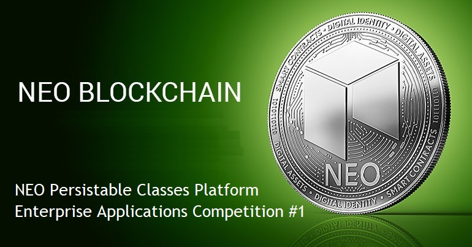

# NEO Blockchain Enterprise Distributed Applications Competition #1

[NEO Blockchain C# Center of Excellence](https://github.com/mwherman2000/neo-csharpcoe/blob/master/README.md)

## What is the NEO Blockchain Enterprise Distributed Applications Competition #1?

Co-sponsored by the [NEO Blockchain C# Developers Center of Excellence](https://github.com/mwherman2000/neo-csharpcoe/blob/master/README.md) ([neo-csharpcoe](https://github.com/mwherman2000/neo-csharpcoe/blob/master/README.md)) and XXXXXXXXX, this contest is an unparalleled opportunity for teams to focus their creativity, passion, and ambition into building enterprise distributed applications on the NEO Blockchain using Microsoft Azure, Microsoft Visual Studio, and C#. 

Online training and support will be provided by the [NEO Blockchain C# Developers Center of Excellence](https://github.com/mwherman2000/neo-csharpcoe/blob/master/README.md) ([neo-csharpcoe](https://github.com/mwherman2000/neo-csharpcoe/blob/master/README.md)). 

The next generation of enterprise distributed applications built using Smart Data on the NEO Blockchain has arrived. 

The total value of the prizes for this competition is USD$10,000.

## Duration

> Duration: 4 weeks

> Start Date: XXXXXXXXXX XXXX XX, 2018 23:59 (11:59PM) PST (US/Canada West Coast)

> End Date: XXXXXXXXXX XXXX XX, 2018 23:59 (11:59PM) PST (US/Canada West Coast)

All submissions must be received by the above End Date to be accepted into the competition. Submissions received after this deadline will not be accepted into this competition.

## Two Award Categories

Submissions can be made by a project comprised of an individual or a team. A project can submit to either a single category or all competition catgories.

**Category 1. Best Enterprise Distributed Applications** 

   Juried competition to choose the best 3 Enterprise Distributed Applications built with Microsoft Azure, Microsoft Visual Studio, C#, and the NEO Persistable Classes Platform on the NEO Blockchain.

   * Prizes will be awarded for first place, second place, and third place.

      | Prize | Value |
      | ----- | ----- |
      | First place | USD$5000 |
      | Second place | USD$3000 |
      | Third place | USD$1000 |

   * Submissions will be independently voted on and selected by three (3) Enterprise Distributed Application specialists.
   * Submissions will be judged based on, but not limited to, the following criteria: 
      
      a) Originality

      b) Potential for re-use and sharing of the application's components across multiple projects (Reusable Entities as well as client-side patterns, entities, protocols, shared data, and other artifacts) - including actual reuse and sharing of Resuble Entities by other project submissions
      
      c) Quality of your project's code, documentation, and videos

 **Category 1. Best Enterprise Distributed Applications - Submission Requirements**
   
   a. For Reusable Entity development, your project must use Microsoft Azure, Microsoft Visual Studio, C#, and the NEO Persistable Classes Platform (NPC Compiler) to create each Reusable Entity class.

   b. Your project's client application and smart contract(s) must use *at least three (3) different Reusable Entity classes*.
   
   c. Your project can develop its own entities and/or re-use any existing Reusable Entities found in the NPC Reusable Entity Gallery [TODO]. Your project can partner with other projects to share entities, functionality, deployed Reusable Entity/smart contracts (including shared data). One Reusable Entity will be supplied in advance: `NPCCounter`. Use of `NPCounter` is optional.

   d. The Reusable Entities for your distributed application must be deployed on [NEO `testnet`](https://neo.org/testnet?culture=en-us). You can use any .NET technology for your client-side application: ASP.NET, WinForms, WPF, Windows Console Application, Windows Service, Azure Web Jobs, etc. You can host and deploy your client-side application anywhere that is publicly accessible/runnable by the judges; Microsoft Azure is preferred.

   e. Resuble Entities must use NEO Persistable Classes Platform features; for example, your Reusable Entities/smart contracts cannot directly call `Storage.Put()` or `Storage.Get()`.

   f. All source code created for your submission must be [MIT Licensed](http://www.opensource.org/licenses/MIT).

   g. **NOTE:** Re-use and sharing of Reusable Entities by other competition project submissions is *encouraged*.

**Category 2: Developers Choice Awards: Best Reusable Entities** 

   * NPC Reusable Entities will be voted on by any developer who enters either: a) the NEO Blockchain Enterprise Distributed Applications Competition: Best Enterprise Distributed Applications category and/or b) Best Reusable Entities category. 

   * The ten (10) Reusable Entities with the most votes will each win one prize.

      | Prize | Value |
      | ----- | ----- |
      | 1 to 10 | USD$100 each |

   * When voting for the Best Reusable Entities, developers are asked to keep the following criteria in mind: 
      
      a) Originality

      b) Potential re-use of an entity across multiple project (smart contract patterns, entities, protocols, shared data, and other artefacts) - including actual reuse and sharing of Resuble Entities by other project submissions
      
      c) Quality of the entity's code, documentation, and videos

**Category 2: Developers Choice Awards: Best Reusable Entities -  Submission Requirements**
   
   a. For Reusable Entity/smart contract development, your project must use Microsoft Azure, Microsoft Visual Studio, C#, and the NEO Persistable Classes Platform (NPC Compiler) to create each Reusable Entity class.

   b. Each of your Reusable Entity's methods must successfully and reliably execute using 10 NeoGas (GAS) or less.
   
   c. If you want to submit a Reusable Entity without developing a submission for the Best Enterprise Distributed Applications category, this is possible as long as someone else's Enterprise Distributed Application project uses your Reusable Entity as part of their submission.

   d. Reusable Entities must use NEO Persistable Classes Platform features; for example, your Reusable Entities/smart contracts cannot directly call `Storage.Put()` or `Storage.Get()`.

   e. Reusable Entities submitted as part of a Best Enterprise Distributed Applications category submission must be submitted separately to the Developers Choice Awards: Best Reusable Entities category.

   f. All source code created for your submission must be [MIT Licensed](http://www.opensource.org/licenses/MIT).
   
   g. **NOTE:** Re-use and sharing of Reusable Entities by other competition project submissions is *encouraged*.

## How to submit your Enterprise Distributed Application and/or Reusable Entities to the competition

TODO

## What is the [NEO Blockchain C# Developers Center of Excellence](https://github.com/mwherman2000/neo-csharpcoe/blob/master/README.md)?

The `neo-csharpcoe` project is an "umbrella" project for several initiatives related to providing tools and libraries (code), frameworks, how-to documentation, and best practices for Enterprise Distributed Application development using .NET/C#, C#.NEO and the NEO Blockchain software platform.

The `neo-csharpcoe` is an independent, free, open source project that is 100% community-supported by people like yourself through your contributions of time, energy, passion, promotion, and donations.

To learn more about contributing to the `neo-csharpcoe`, click [here](https://github.com/mwherman2000/neo-csharpcoe/blob/master/CONTRIBUTE.md).

# Best wishes entering the competition