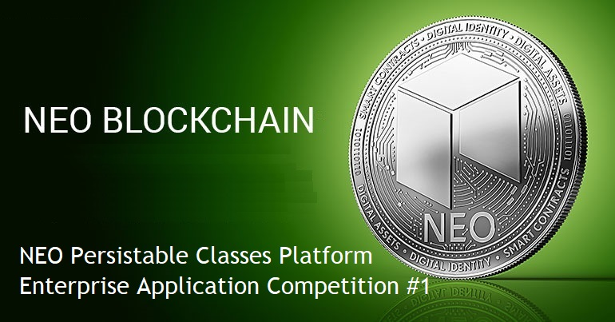

# NEO Persistable Classes Platform: NEO Blockchain Enterprise Application Competition #1

NEO Persistable Classes (NPC e-dApp) Platform: NEO Blockchain Enterprise Application Competition #1

[NEO Blockchain C# Center of Excellence](https://github.com/mwherman2000/neo-csharpcoe/blob/master/README.md)

## What is the NEO Blockchain Enterprise Application Competition #1?

Co-sponsored by the [NEO Blockchain C# Developers Center of Excellence](https://github.com/mwherman2000/neo-csharpcoe/blob/master/README.md) ([neo-csharpcoe](https://github.com/mwherman2000/neo-csharpcoe/blob/master/README.md)), this contest is an unparalleled opportunity for teams to focus their creativity, passion, and ambition into building reusable enterprise applications on the NEO Blockchain.

## Duration

> 6 weeks

> Start: XXXXXXXXXX XXXX XX, 2018 23:59 (11:59PM) PST (US/Canada West Coast)

> End: XXXXXXXXXX XXXX XX, 2018 23:59 (11:59PM) PST (US/Canada West Coast)

## Two Award Categories

**Category 1. Best Enterprise Applications** built using the NEO Persistable Classes (NPC e-dApp) Platform

   Juried competition to choose the best 3 enterprise applications built with the NEO Persistable Classes (NPC e-dApp) Platform on the NEO Blockchain.

   * Prizes will be awarded for first place, second place, and third place.
      | Prize | Value |
      | ----- | ----- |
      | First place | USD$5000 |
      | Second place | USD$3000 |
      | Third place | USD$1000 |
   * Submissions will be independently voted on and selected by 3 enteprise application specialists.
   * Submissions will be judged based on, but not limited to, the following criteria: 
      
      a) originality, 

      b) potential for re-use and sharing of the application's components across multiple projects (smart contract as well as client-side patterns, entities, protocols, shared data, and other artifacts) - as well as actual reuse and sharing of Resuble Entities by other project submissions
      
      c) quality of your project's code, documentation, and videos

 **Category 1. Best Enterprise Applications - Submission Requirements**
   
   a. For smart contract/Reusable Entity development, your project must use the NEO Persistable Classes (NPC e-dApp) Platform and NPC Compiler to create each entity class

   b. Your project's client application and smart contract(s) must use *at least three (3) different NPC Resuable Entity classes*.
   
   c. Your project can develop its own entities and/or re-use any existing Resuable Entities found in the NPC Entity Gallery [TODO]. Your project can partner with other projects to share entities, functionality, and/or deployed Reusable Entity smart contracts (including shared data). One NPC entity will be supplied in advance: `NPCCounter`. Use of `NPCounter` is optional.

   d. The smart contacts/Reusable Entities for your enterprise application must be deployed on [`testnet`](https://neo.org/testnet?culture=en-us). You can use any .NET technology for your client-side application: ASP.NET, WinForms, WPF, Windows Console Application, Windows Service, Azure Web Jobs, etc. You can host and deploy your client-side application anywhere that is publicly accessible/runnable by the judges.

   e. Resuble Entities must use NEO Persistable Classes (NPC e-dApp) Platform features; for example, Resuable Entities cannot directly call `Storage.Put()` or `Storage.Get()`.

   **NOTE:** Re-use and sharing of Reusable Entities by other project submissions is encouraged.

**Category 2: Developers Choice Awards: Best Reusable Entities** built using the NEO Persistable Classes (NPC e-dApp) Platform

   * NPC Reusable Entities will be voted on by any developer who enters the NEO Blockchain Enterprise Application Competition: Best Enteprise Applications category and/or Best Reusable Entities category. 
   * The ten (10) Reusable Entities with the most votes will win one prize each.

      | Prize | Value |
      | ----- | ----- |
      | 1 to 10 | USD$100 each |

   * When voting for the Best Resuable Entities, developers are asked to keep the following criteria in mind: 
      
      a) originality, 

      b) potential re-use of an entity across multiple project (smart contract patterns, entities, protocols, shared data, and other artefacts) - as well as actual reuse and sharing of Resuble Entities by other project submissions
      
      c) quality of the entity's code, documentation, and videos

**Category 2: Developers Choice Awards: Best Reusable Entities -  Submission Requirements**
   
   a. For smart contract/Reusable Entity development, your project must use the NEO Persistable Classes (NPC e-dApp) Platform and NPC Compiler to create each entity class

   b. Each of your Reusable Entity's methods must successfully and reliably execute using 10 Gas or less.
   
   c. If you want to submit a Reusable Entity without developing a submission for the Best Enterprise Application category, this is possible as long as someone else's Enterprise Application project uses your Reusable Entity as part of their submission.

   d. Reusable Entities must use NEO Persistable Classes (NPC e-dApp) Platform features; for example, Resuable Entities cannot directly call `Storage.Put()` or `Storage.Get()`.

   e. Reusable Entities submitted to the Best Enterprise Applications category must be submitted separately to the Developers Choice Awards: Best Reusable Entities category.
   
   **NOTE:** Re-use and sharing of Reusable Entities by other project submissions is encouraged.

## How to submit your Enterprise Application and/or Reusable Entityies

TODO

## What is the [NEO Blockchain C# Developers Center of Excellence](https://github.com/mwherman2000/neo-csharpcoe/blob/master/README.md)?

The `neo-csharpcoe` project is an "umbrella" project for several initiatives related to providing tools and libraries (code), frameworks, how-to documentation, and best practices for enterprise application development using .NET/C#, C#.NEO and the NEO Blockchain software platform.

The `neo-csharpcoe` is an independent, free, open source project that is 100% community-supported by people like yourself through your contributions of time, energy, passion, promotion, and donations.

To learn more about contributing to the `neo-csharpcoe`, click [here](https://github.com/mwherman2000/neo-csharpcoe/blob/master/CONTRIBUTE.md).

