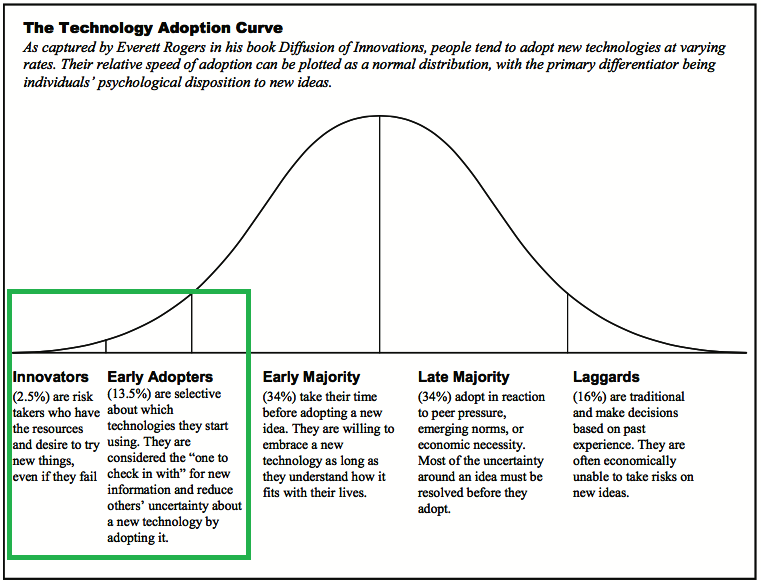
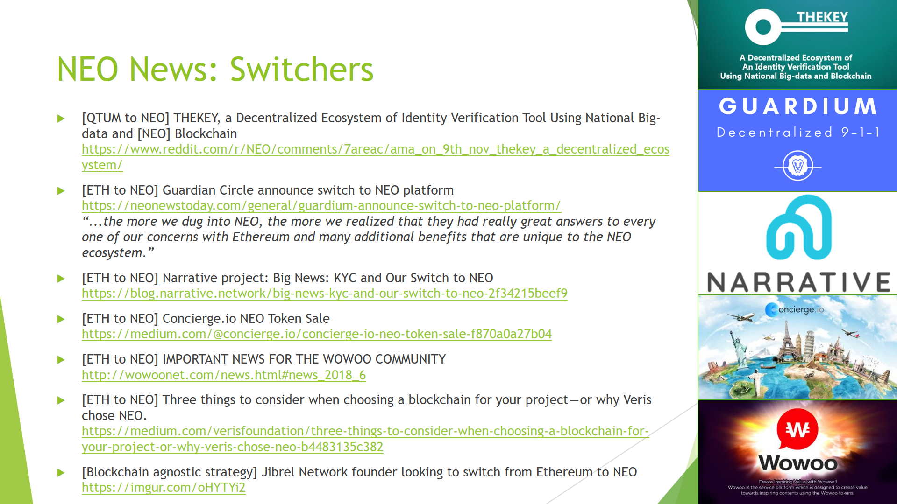
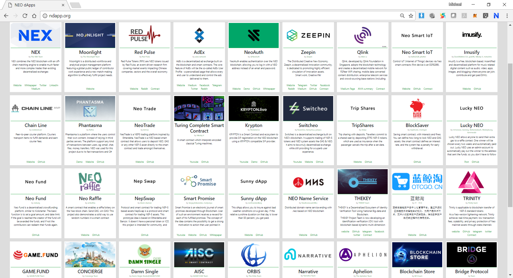
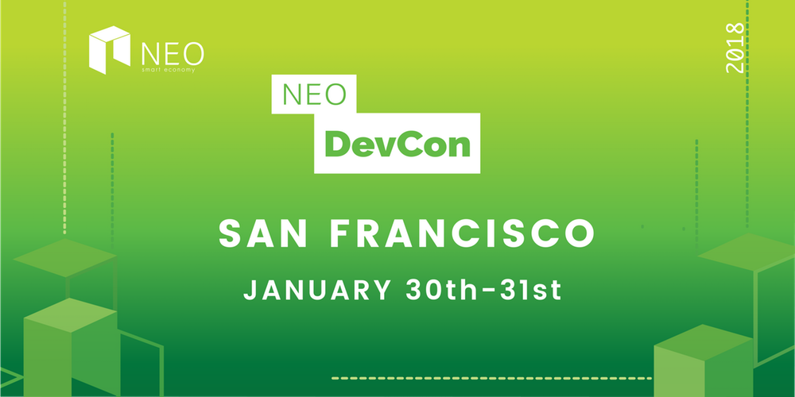
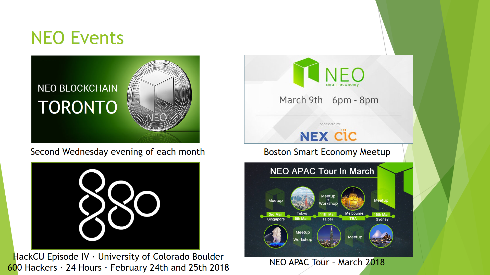
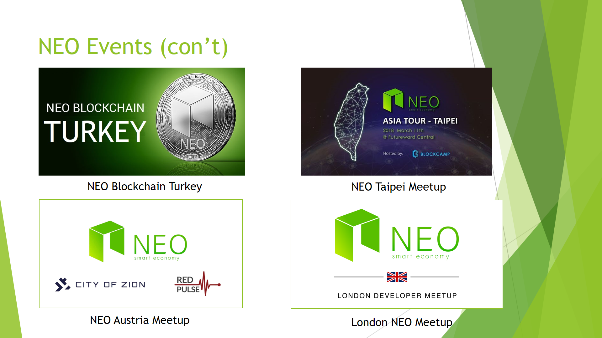
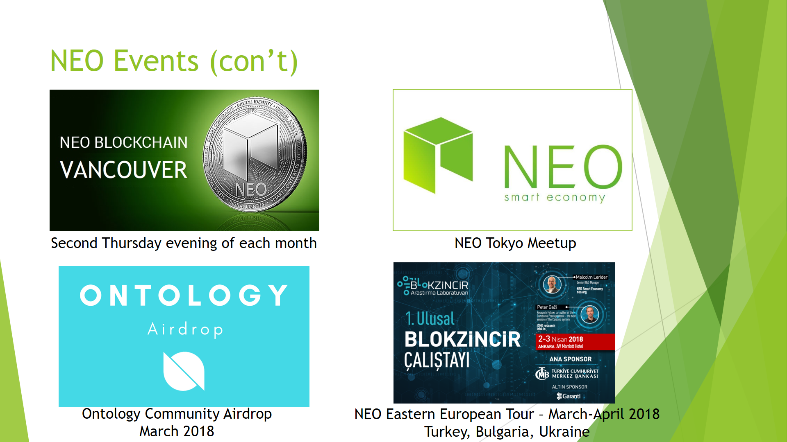
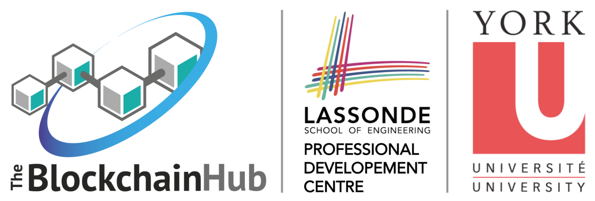

# How can the NEO Blockchain driving a resurgence in the adoption of Microsoft Azure, .NET, Visual Studio and C# for Enterprise Application Development?

[NEO Blockchain C# Center of Excellence](https://github.com/mwherman2000/neo-csharpcoe/blob/master/README.md)

## Topics
* [Background: NEO Blockchain as an Enterprise .NET and C# Platform](https://github.com/mwherman2000/neo-csharpcoe/blob/master/competitions/NPCEntAppCompetitions/DrivingDotNetResurgenceWithNEOBlockchain.md#background-neo-blockchain-as-an-enterprise-net-and-c-platform)
* [Driving a Resurgence in Enterprise Adoption of Microsoft Azure, .NET, Visual Studio and C#](https://github.com/mwherman2000/neo-csharpcoe/blob/master/competitions/NPCEntAppCompetitions/DrivingDotNetResurgenceWithNEOBlockchain.md#driving-a-resurgence-in-enterprise-adoption-of-microsoft-azure-net-visual-studio-and-c)
   * [*First Mover Advantage* in a New Market: Distributed Applications Development](https://github.com/mwherman2000/neo-csharpcoe/blob/master/competitions/NPCEntAppCompetitions/DrivingDotNetResurgenceWithNEOBlockchain.md#first-mover-advantage-in-a-new-market-distributed-applications-development)
   * [The Best and Only Blockchain Platform developed entirely on .NET](TODO)
   * [The Best Blockchain Developer Tool Suite](https://github.com/mwherman2000/neo-csharpcoe/blob/master/competitions/NPCEntAppCompetitions/DrivingDotNetResurgenceWithNEOBlockchain.md#the-best-blockchain-developer-tool-suite)
   * [Enterprise Distributed Applications and Smart Data: Enabled by .NET and C#](https://github.com/mwherman2000/neo-csharpcoe/blob/master/competitions/NPCEntAppCompetitions/DrivingDotNetResurgenceWithNEOBlockchain.md#enterprise-distributed-applications-and-smart-data-enabled-by-net-and-c)
   * [Large Base of .NET and C# Developers](https://github.com/mwherman2000/neo-csharpcoe/blob/master/competitions/NPCEntAppCompetitions/DrivingDotNetResurgenceWithNEOBlockchain.md#large-base-of-net-and-c-developers)
* [Call to Action](https://github.com/mwherman2000/neo-csharpcoe/blob/master/competitions/NPCEntAppCompetitions/DrivingDotNetResurgenceWithNEOBlockchain.md#call-to-action)

* [Appendix A - Evidence of the NEO Blockchain's Presence and Success in the Worldwide Developer Ecosystem](https://github.com/mwherman2000/neo-csharpcoe/blob/master/competitions/NPCEntAppCompetitions/DrivingDotNetResurgenceWithNEOBlockchain.md#appendix-a---evidence-of-the-neo-blockchains-presence-and-success-in-the-worldwide-developer-ecosystem)
   * NEO Switchers
   * NEO Partners
   * Worldwide Events
   * Training and Certification
   * NEO Blockchain Developer Resources

* [Appendix B - Popularity of the C# Programming Language](https://github.com/mwherman2000/neo-csharpcoe/blob/master/competitions/NPCEntAppCompetitions/DrivingDotNetResurgenceWithNEOBlockchain.md#appendix-b---popularity-of-the-c-programming-language)
   * Table 1. Google Search Results: "most popular programming languages"

* [What is the NEO Blockchain C# Developers Center of Excellence](https://github.com/mwherman2000/neo-csharpcoe/blob/master/competitions/NPCEntAppCompetitions/DrivingDotNetResurgenceWithNEOBlockchain.md#what-is-the-neo-blockchain-c-developers-center-of-excellence)

## Background: NEO Blockchain as an Enterprise .NET and C# Platform

* The NEO Blockchain is an open source platform project for enterprise distributed applications.
* All of the NEO Blockchain core components are written entirely using .NET, C# and Visual Studio including:

  * NEO Consensus Node
  * NEO Virtual Machine
  * NEO Transcompiler
  * NEO Debugger
  * NEO Source-code Level Execution Cost Profiler
  * NEO Developer's Wallet
  * NEO Smart Contract Visual Studio Extension

* C# is the reference language for developing smart contracts deployed on the NEO Blockchain.  Other languages such as Python, Java, JavaScript, and Golang are also support for smart contract development.

* C#, using the NEO Persistable Classes Platform, is the only NEO smart contract development environment capable to supporting enterprise-class distributed application development.

* The NEO Blockchain is currently the #2 programmable blockchain platform. However, Ethereum, the #1 programmable blockchain platform, has show-stopping limitations in terms of scalability, performance, and capability as an enterprise distributed applications platform as exemplified by the following quotations:

  > The Ethereum community, key developers and researchers and others have always recognized scalability as perhaps the single most important key technical challenge that needs to be solved in order for blockchain applications to reach mass adoption. Blockchain scalability is difficult primarily because a typical blockchain design requires every node in the network to process every transaction, which limits the transaction processing capacity of the entire system to the capacity of a single node.[Ethereum scalability research and development subsidy programs, Vitalik Buterin, Ethereum Founder](https://blog.ethereum.org/2018/01/02/ethereum-scalability-research-development-subsidy-programs/)

  > Ethereum is a *one-trick pony x 1500* because the Solidity language used for developing Ethereum smart contracts is only able to represent a simple, single entity per smart contract. [[NEO Blockchain Vancouver Meetup Kick-off Presentation, Slide 59, Michael Herman](https://github.com/mwherman2000/neo-csharpcoe/tree/master/events/2018-NEO-Blockchain-Vancouver)]

## Driving a Resurgence in Enterprise Adoption of Microsoft Azure, .NET, Visual Studio and C#

* Millennials have a high attraction the blockchain investing and trading [[CNBC: Cryptocurrencies are the 'greatest opportunity' to get millennials to trade: TD Ameritrade](https://www.cnbc.com/2018/01/08/cryptocurrencies-are-the-greatest-opportunity-to-get-millennials-to-trade-td-ameritrade.html)].

* Millennials Developers, as a category, have a huge attraction to blockchain software development. [[ComputerWorld: Blockchain jobs continue to explode, offer salary premiums](https://www.computerworld.com/article/3235972/it-careers/blockchain-jobs-continue-to-explode-offer-salary-premiums.html)]

   >Blockchain development is the second-hottest skill in the job market today, growing more than 200% since this time last year.

### *First Mover Advantage* in a New Market: Distributed Applications Development

* Blockchain development, specifically distributed applications and smart contract development, is a new innovator/early adopter market for developers and partners as well as enterprise organizations.  There is a huge *first mover advantage* for .NET and C# in this market by supporting and leveraging the NEO Blockchain as a platform.

   

### The Best and Only Blockchain Platform developed entirely on .NET

* As reiterated above, the NEO Blockchain is the only programmable blockchain platform that written entirely in .NET and C# using Visual Studio.  This has multiple benefits:

   * C# is the reference language for developing smart contracts deployed on the NEO Blockchain. Visual Studio is the reference IDE for smart contract development. [[NEO Blockchain C# Developers Center of Excellence: NEO Blockchain Quick Start Guide for .NET Developers](https://github.com/mwherman2000/neo-dotnetquickstart/blob/master/README.md)]

   * .NET, C#, and Visual Studio are the tools used to create all of the NEO Blockchain's core components and all of these are open source projects on GitHub. This means that the same .NET, C# and Visual Studio skills and experience used to create NEO smart contracts can also be used to read, understand, and contribute to the NEO core components. For example, the NEO VM's `Execution Engine` is a straight-forward C# class that can be self-hosted in **any** .NET application like a script engine - even non-blockchain applications. [[The Neo Project (neo-project)](https://github.com/neo-project)]

     * NEO Consensus Node ([neo-cli](https://github.com/neo-project/neo-cli))
     * NEO Virtual Machine ([neo-vm](https://github.com/neo-project/neo-vm))
     * NEO Transcompiler ([neo-compiler](https://github.com/neo-project/neo-compiler))
     * NEO Debugger ([neo-debugger-tools](https://github.com/CityOfZion/neo-debugger-tools))
     * NEO Source-code Level Execution Cost Profiler ([neo-debugger-tools](https://github.com/CityOfZion/neo-debugger-tools))
     * NEO Developer's Wallet ([neo-gui-developer](https://github.com/CityOfZion/neo-gui-developer))
     * NEO Smart Contract Visual Studio Extension ([neo-devpack-dotnet](https://github.com/neo-project/neo-devpack-dotnet))

### The Best Blockchain Developer Tool Suite

* .NET, C#, Visual Studio, and the NEO Smart Contract Visual Studio Extension is the best developer tool suite for creating smart contracts - including seamless integration with the NEO Debugger.

* NEO was very clever in its integration with the Microsoft .NET compiler stack. NEO developers build what is essentially a Windows console application with `Main` method prototype that often looks something like `public static Object Main(string operation, params object[] args)` - but `Main` can take virtually any parameters and return any parameters (including simple types, an instance of a class, an array of instances of a class). 

* Smart contracts are built as plain-old C# class projects. The NEO Compiler is then run as a post-build step to transcompile MSIL patterns from the assembly (DLL file) into a .AVM NEO VM byte code file.

* All of the features of the Visual Studio IDE and .NET/C# environment are available include the .NET/C# optimizing compiler features which have been demonstrated to reduce NEO VM by 25%. This is a key capability because every NEO VM instruction executed is tracked and accounted for. ([NEO System Fees](http://docs.neo.org/en-us/sc/systemfees.html)).

### Enterprise Distributed Applications and Smart Data: Enabled by .NET and C#

What is unique about Enterprise Distributed Application development on a blockchain?  ...the NEO Blockchain or any other blockchain.

* While people talk mostly about *smart contracts* in the context of programmable blockchain development, it is really about *Smart Data* living on the public Internet (as well as private networks and consortium networks).  Smart Data that is both trustful and trustless.  Trustful because a transaction has been confirmed on the NEO Blockchain, it is there forever: unchangeable and irrefutable. ...free from any form of centralized control. Trustless because once confirmed on the blockchain, the Smart Data is digitally signed and completely decentralized.
* The only way to place data on the NEO Blockchain is to write a smart contract that will, via a NEO transaction, put it there for you. Every placement of data (C# entities) is wrapped in the code of some application's smart contract - digitally signed and deployed in the same way Smart Data is digitally signed and confirmed into the NEO Blockchain.

* To learn more, checkout [[NEO Whitepaper](http://docs.neo.org/en-us/)]

### Large Base of .NET and C# Developers

The Large Base of .NET and C# Developers = Huge Opportunity to create Resurgence in the Enterprise Adoption of Microsoft Azure, .NET, Visual Studio and C#.

* Incremental technology education, training, and adoption

* There are several million .NET developers worldwide - possibly close to 10 million in 2018.

   * >There are roughly 6 million professional developers worldwide, about 90% of whom target Windows. 4-5 million of those 6 million developers targeting Windows are Visual Basic developers. There are about 2.5 mln .NET developers. More than 60% of the Fortune 100 develop using .NET. Forrester says that 56% of enterprises in North America are choosing .NET for their development requirements vs. 44% choosing J2EE. [.NET developer statistics - a word from Microsoft, July 19, 2004](http://www.zdnet.com/article/net-developer-statistics-a-word-from-microsoft/)

   * >There are 3.1 million monthly active developers across all Microsoft products as of August 2016, of which 1.5 million C++ developers using Visual Studio and over 2 million .net developers (including C# of course), according to Amanda Silver ([MSDN: How Many Developers Use C++ vs. C# vs. Other Programming Languages, October 24, 2016](https://blogs.msdn.microsoft.com/zxue/2016/10/24/how-many-developers-use-c-vs-c-vs-other-programming-languages/)).

* C# does not rank very high on most programming language surveys - typically, 5th place or less.

## Call to Action

TODO

## Appendix A - Evidence of the NEO Blockchain's Presence and Success in the Worldwide Developer Ecosystem

### NEO Switchers

* Distributed application projects that have switched from another blockchain platform to the NEO Blockchain

   

### NEO Partners 

* NEO Distributed Applications Catalog (http://ndapp.org/)

  

### Worldwide Events

* NEO DevCon 2018, January 30-31, 2018

   

* NEO Events - Tours, Workshops, Hackathons, Meetups

   

   

   

### Training and Certification

* CND Certified NEO Enterprise Developer Program at York University/The Blockchain Hub, Toronto, Canada

   

   

### NEO Blockchain Developer Resources

* Webcasts

   * [The New Vision - Da Hongfei](https://www.youtube.com/watch?v=th7jZlmoZBc)
   * [Malcolm Lerider: Clarification on NEO, GAS and Consensus Nodes](https://www.youtube.com/watch?v=iV4WREWtCiI)
   * [A Deep Dive into NeoVM & NeoContract (English Subtitles)](https://www.youtube.com/watch?v=fLppte-guYE)
   * [NEO Persistable Classes (NPC) e-dApp Smart Contract Platform 2.0: Deep Dive](https://www.youtube.com/watch?v=Nj4-m2o94VE)

* Community Sites

   * [NEO – Reddit](https://www.reddit.com/r/NEO/)
   * [NEO Discord #csharp Channel](https://discord.gg/gqCYeup) 

* NEO DevCon - Selected Sessions

   * [The New Vision - Da Hongfei | NEO DevCon 1](https://www.youtube.com/watch?v=th7jZlmoZBc)
   * [Opening Address - Scott Hunter, Microsoft | NEO DevCon 1](https://www.youtube.com/watch?v=ZFsu5HPU2xM) 
   * [Ontology, The Technical Vision of Distributed Trust Networks | NEO DevCon 1](https://www.youtube.com/watch?v=QyaZz0vtONs)
   * [Imusify, Decentralized Platform for Music Related Digital Content | NEO DevCon 1](https://www.youtube.com/watch?v=dgmfO8nKJkE)
   * [NeoAuth, Login Using the NEO Blockchain | NEO DevCon 1](https://www.youtube.com/watch?v=F7teukbcbIg) 
   * [Phantasma, User-Owned Content | NEO DevCon 1](https://www.youtube.com/watch?v=cinexz6gjsU)
   * [NEO•ONE, Development Framework | NEO DevCon 1](https://www.youtube.com/watch?v=yWzjNhiZFmA)
   * [THEKEY, A Decentralized Ecosystem of An Identity Verification Tool | NEO DevCon 1](https://www.youtube.com/watch?v=St-UW0lPB7o) 
   * [NEO’s Global Vision and the Evolving Regulatory Environment - Miles Graham | NEO DevCon 1](https://www.youtube.com/watch?v=FidRGNeab3I)
   * [NEX, Decentralized Exchanges | NEO DevCon 1](https://www.youtube.com/watch?v=1005ed20e0Q) 

* NEO Developer Resources

   * [NEO C# Developers Center of Excellence (neo-csharpcoe)](https://github.com/mwherman2000/neo-csharpcoe/blob/master/README.md)
   * [NEO Blockchain Quick Start Guide for .NET Developers](https://github.com/mwherman2000/neo-dotnetquickstart/blob/master/README.md)]
   * [NEO Tutorials  (C#, Java, Python), API docs](http://docs.neo.org)
   * [NEO DevCon “Th New Vision” Keynote by NEO Founder](https://www.youtube.com/watch?time_continue=3&v=th7jZlmoZBc)
   * [The NEO Project](https://github.com/neo-project)
   * [City of Zion awesome-neo project: Developer Docs](https://github.com/CityOfZion/awesome-neo/#developer-documentation) 

## Appendix B - Popularity of the C# Programming Language

### Table 1. Google Search Results: "[`most popular programming languages`](https://www.google.ca/search?q=most+popular+programming+languages&rlz=1C1CHBF_enCA780CA780&oq=most+popular+progra&aqs=chrome.0.0l2j69i57j0l3.12221j1j4&sourceid=chrome&ie=UTF-8)"

Listed in *search results order*

| Source | C# Rank | Top 5 Languages | Date Published |
| ------ | ------- | ----- | ---- |
| [Inc: 10 Most Popular Programming Languages Today](https://www.inc.com/larry-kim/10-most-popular-programming-languages-today.html) | 6th | Java, Python, C, Ruby, JS | June 1, 2015 |
| [TIOBE Index for March 2018](https://www.tiobe.com/tiobe-index/) | 5th | Java, C, C++, Python, C# | March 17, 2018 |
| [Stackify: Most Popular and Influential Programming Languages of 2018](https://stackify.com/popular-programming-languages-2018/) | 4th (Very Long Term History Chart) | Java, C, C++, C#, Python | December 18, 2017 |
| [GitHub: The State of the Octoverse 2017](https://octoverse.github.com/) | 8th | JS, Python, Java, Ruby, PHP | December 2017 |
| [Gewirtz-ZDNet: Which programming languages are most popular (and what does that even mean?](http://www.zdnet.com/article/which-programming-languages-are-most-popular-and-what-does-that-even-mean/) | 6th | Java, C, Python, C++, JS | October 4, 2017 |
| [BusinessInsider: The 15 most popular programming languages, according to the 'Facebook for programmers'](http://www.businessinsider.com/the-9-most-popular-programming-languages-according-to-the-facebook-for-programmers-2017-10) | 8th | JS, Python, Java, Ruby, PHP | October 11, 2017 |
| [CodingDojo: The 7 Most In-Demand Programming Languages of 2018 (Indeed.com)](http://www.codingdojo.com/blog/7-most-in-demand-programming-languages-of-2018/) | 5th | Java, Python, JS, C++, C# | December 13, 2017 |
| [Medium.com/The Startup: Best 10 Programming Languages to learn in 2018](https://medium.com/swlh/best-10-programming-languages-to-learn-in-2018-2d6cbc5ffc2a) | 8th |  Swift, Ruby, PHP, C++, C | December 7, 2017 |
| [TechRepublic: The 5 most popular programming languages among female developers](https://www.techrepublic.com/article/the-5-most-popular-programming-languages-among-female-developers/) | < 5th  | Java, JavaScript, C, C++, Python | March 1, 2018 |
| [TechRepublic: The 10 coding languages top developers plan to learn next](The 10 coding languages top developers plan to learn next) | <  5th | Go, Python, Scala, Kotlin, Ruby (developers are planning to learn next) | January 23, 2018 |
| [TechRepublic: The 10 coding languages top developers plan to learn next](The 10 coding languages top developers plan to learn next) | < 5th | JavaScript, Java, Python, C++, C (employers are looking to hire)|  January 23, 2018 |
| [InformationWeek: 10 Most In-Demand Programming Languages of 2018](https://www.informationweek.com/devops/programming-languages/10-most-in-demand-programming-languages-of-2018/d/d-id/1330856) | 5th | Java, Python, JS, C++, C# | January 22, 2018 |
| [Stackoverflow: Developer Survey Results 2017](https://insights.stackoverflow.com/survey/2017) "In the five years we've been collecting the Developer Survey, we've seen languages such as Python and Node.js grow in popularity, while the usage of languages like C# and C has been shrinking."| 4th | JS, SQL, Java, C#, Python | December 31, 2017 |
| [Stackoverflow: Developer Survey Results 2017](https://insights.stackoverflow.com/survey/2017) Most Loved |  8th | Rust, Smalltalk, TypeScript, Swift, Go  | December 31, 2017 |
| [Stackoverflow: Developer Survey Results 2017](https://insights.stackoverflow.com/survey/2017) Most Wanted |  7th | Python, JS, Go, C++, Java | December 31, 2017 |
| [Stackoverflow: Developer Survey Results 2017](https://insights.stackoverflow.com/survey/2017) Most Popular Languages by Occupation | 3rd - 5th | JS, SQL, C#, Java, PHP, Python, C++  | December 31, 2017 |

## What is the [NEO Blockchain C# Developers Center of Excellence](https://github.com/mwherman2000/neo-csharpcoe/blob/master/README.md)?

The `neo-csharpcoe` project is an "umbrella" project for several initiatives related to providing tools and libraries (code), frameworks, how-to documentation, and best practices for Enterprise Distributed Application development using .NET/C#, C#.NEO and the NEO Blockchain software platform.

The `neo-csharpcoe` is an independent, free, open source project that is 100% community-supported by people like yourself through your contributions of time, energy, passion, promotion, and donations.

To learn more about contributing to the `neo-csharpcoe`, click [here](https://github.com/mwherman2000/neo-csharpcoe/blob/master/CONTRIBUTE.md).

